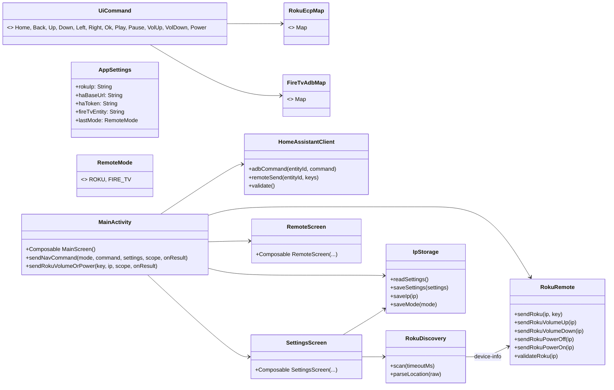
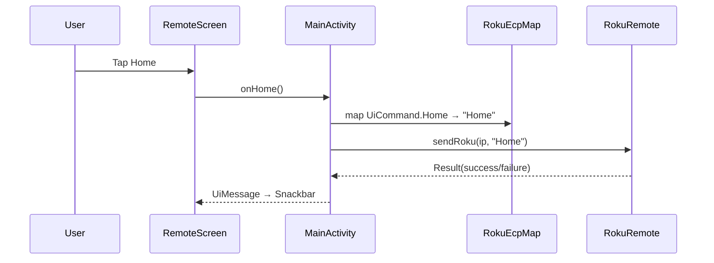
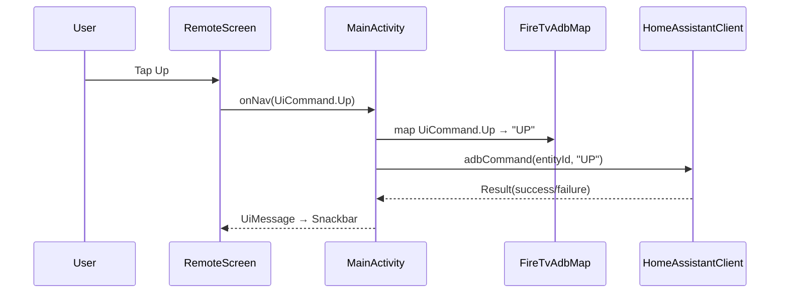
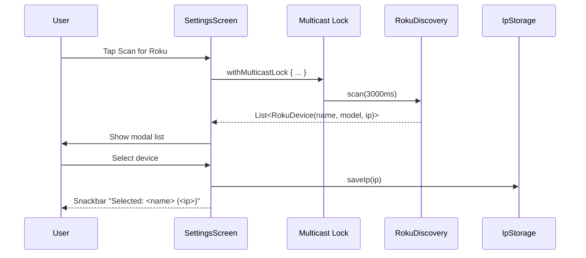

# DIAGRAMS — Architecture and Flows

Mermaid diagrams describing current code paths.

## Class/module overview



## Sequence: Tap "Home" in Roku mode



## Sequence: Tap "Up" in Fire TV mode



## Sequence: Run "Scan for Roku"



## State: Mode toggle and routing

```mermaid
stateDiagram-v2
  [*] --> Roku
  Roku --> FireTV: User toggles
  FireTV --> Roku: User toggles

  state Roku {
    [*] --> Navigating
  }
  state FireTV {
    [*] --> Navigating
  }

  note right of Roku
    Navigation → RokuEcpMap → RokuRemote
  end note

  note right of FireTV
    Navigation → FireTvAdbMap → HomeAssistantClient
  end note

  note bottom of stateDiagram-v2
    VolumeUp/Down & Power always go to RokuRemote
  end note
```
